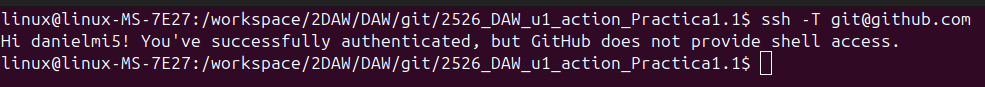

# Práctica 1.1 documentación con github actions

## Documentación

- **Herramientas usadas y comandos ejecutados**:

Para la creación automática de documentación he utilizado GitHub Actions como herramienta de integración continua. El proyecto está desarrollado con Java 21 y la documentación se genera utilizando JavaDoc, siguiendo el estilo Javadoc en la documentación del código. La generación de la documentación se realiza mediante el comando `javadoc -d docs src/main/java/*.java` usado en el workflow, que crea la documentación en formato HTML.

- **Ejemplo de como se ha documentado el código aplicando Javadoc**:
https://github.com/danielmi5/2526_DAW_u1_action_Practica1.1/blob/633c41bb62c170fbff0a9dca890dd6c99719481c/src/main/java/Main.java#L78-L95
Al principio del comentario utilizo la descripción de lo que hace el método (en este caso: factorial) y utilizo etiquetas de Javadoc como:
  - `@param` para describir el parámetro que recibe el método.
  - `@return` para describir el valor que se devuelve.
  - `@throw` para indicar la excepción que se lanza y el por qué.
 
- **Formatos generados de la documentación**:
  - HTML: Genero la documentación en formato HTML mediante JavaDoc, esta se genera el la carpeta docs/ ([enlace a la carpeta](https://github.com/danielmi5/2526_DAW_u1_action_Practica1.1/tree/main/docs))

- **Explicación del [workflow](https://github.com/danielmi5/2526_DAW_u1_action_Practica1.1/blob/main/.github/workflows/ci.yaml)**:
Los eventos que disparan el workflow son:
    - Hacer push a la rama main.
    - workflow_dispatch: permite ejecutar manualmente desde GitHub en [Actions](https://github.com/danielmi5/2526_DAW_u1_action_Practica1.1/actions/workflows/ci.yaml).
      
Pasos del job **auto-doc**:
1. **Checkout del repositorio**
   - Acción: `actions/checkout@v3`
   - Clona el repositorio.

2. **Configuración de Java**
   - Acción: `actions/setup-java@v5` (La versión es la última y también la única que soporta Java 21)
   - Configura Java 21 (Temurin).

3. **Generación de la documentación**

   * Comando: `javadoc -d docs src/main/java/*.java`
   * Genera la documentación HTML en la carpeta docs/.

4. **Commit automático**

   * Acción: `stefanzweifel/git-auto-commit-action@v4`
   * Hace commit de los cambios en la carpeta docs/ con el mensaje "Documentación JavaDoc actualizada".

- **Evidencia de la conexión a github mediante SSH**:

## Preguntas

### a. Identificación de herramientas de generación de documentación
¿Qué herramienta o generador (p. ej., Sphinx, pdoc, Javadoc, Doxygen, Dokka) utilizaste en el workflow para crear la documentación en /docs?

### b. Documentación de componentes
Muestra un fragmento del código con comentarios/docstrings estructurados (p. ej., :param, :return: o etiquetas equivalentes) que haya sido procesado por la herramienta.  
Comenta qué estilo de documentación has utilizado (p. ej., reStructuredText, Google Style, KDoc).

### c. Multiformato
¿Qué segundo formato (además de HTML) generaste?  
Explica la configuración o comandos del workflow y herramientas que lo producen.

### d. Colaboración
Explica cómo GitHub facilita mantener la documentación (actualizaciones del README.md y de /docs) cuando colaboran varias personas (PRs, reviews, checks de CI, protección de ramas).

### e. Control de versiones
Muestra mensajes de commit que evidencien el nuevo workflow.  
¿Son claros y descriptivos? Justifícalo. Además, incluye un conjunto de mensajes de tus commits.

### f. Accesibilidad y seguridad
¿Qué medidas/configuración del repositorio garantizan que solo personal autorizado accede al código y la documentación?  
(p. ej., repositorio privado, equipos, roles, claves/secretos, branch protection).

### g. Instalación/uso documentados
Indica dónde en el README.md explicas el funcionamiento del workflow y dónde detallas las herramientas y comandos de documentación.

### h. Integración continua
Justifica por qué el workflow utilizado es CI.  
¿Qué evento dispara automáticamente la generación/actualización de la documentación (p. ej., push, pull_request, workflow_dispatch)?

## Conclusiones
